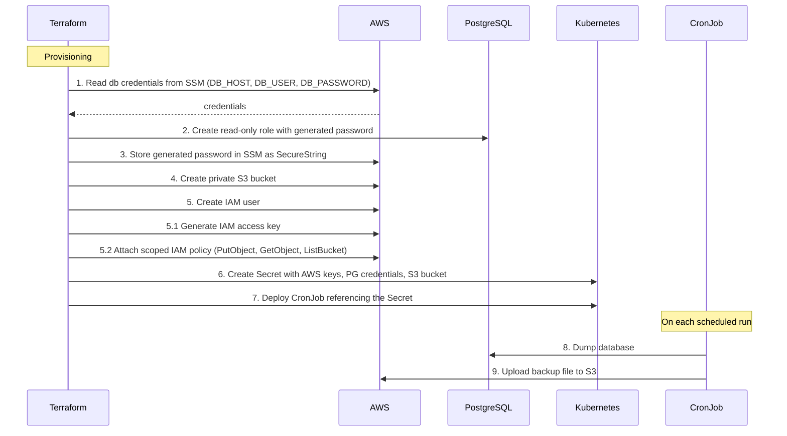

# pg-backup-terraform

Terraform module that provisions all infrastructure required to run automated PostgreSQL backups to S3 on a Kubernetes cluster.

The backup is performed by the [pg-backup-script](https://github.com/Invasor-de-Fronteiras/pg-backup-script) Docker image, which runs as a Kubernetes CronJob.

## What this module does

- Creates a dedicated **PostgreSQL role** with read-only access (`pg_read_all_data`) to the target database
- Generates a random password for the backup user and stores it in **AWS SSM Parameter Store**
- Creates a private **S3 bucket** with public access blocked to store the backup files
- Creates an **IAM user** with a scoped policy allowing only `PutObject`, `GetObject`, and `ListBucket` on the backup bucket
- Stores all credentials (AWS keys, DB host, user and password, S3 bucket) in a **Kubernetes Secret**
- Deploys a **Kubernetes CronJob** that runs the backup container on a configurable schedule

## Architecture

### Steps

> AWS services (SSM, S3, IAM) are grouped into a single **AWS** participant in the diagram above for clarity, since the relevant boundary is AWS vs. PostgreSQL vs. Kubernetes — not which specific AWS service is involved.

1. **Read db credentials from SSM**: Terraform reads the existing SSM parameter containing `DB_HOST`, `DB_USER`, and `DB_PASSWORD` to configure the PostgreSQL provider during provisioning.
2. **PostgreSQL Role**: Terraform creates a dedicated read-only role with `CONNECT`, `USAGE`, and `SELECT` privileges, and assigns `pg_read_all_data` for PostgreSQL 14+.
3. **Store backup user password in SSM**: The generated password for the backup role is stored in SSM as a `SecureString` for auditability.
4. **S3 Bucket**: A private S3 bucket is created with all public access blocked to store the backup files.
5. **IAM User + Access Key + Policy**: An IAM user is created with an access key and a scoped policy allowing only `PutObject`, `GetObject`, and `ListBucket` on the backup bucket.
6. **Kubernetes Secret**: All credentials are combined into a single Kubernetes secret: AWS keys, PostgreSQL host/user/password, and S3 bucket details.
7. **Kubernetes CronJob**: A CronJob is deployed that runs the backup container on the configured schedule, sourcing all credentials from the secret via `env_from`.
8. **Dump database**: On each scheduled run, the container connects to PostgreSQL and dumps the target database.
9. **Upload backup to S3**: The dump file is uploaded to the S3 bucket.

<!-- BEGIN_TF_DOCS -->
## Requirements

| Name | Version |
|------|---------|
|  [terraform](#requirement\_terraform) | >=1.14 |
|  [aws](#requirement\_aws) | 6.33.0 |
|  [kubernetes](#requirement\_kubernetes) | 3.0.1 |
|  [postgresql](#requirement\_postgresql) | 1.26.0 |
|  [random](#requirement\_random) | 3.8.1 |

## Providers

| Name | Version |
|------|---------|
|  [aws](#provider\_aws) | 6.33.0 |
|  [kubernetes](#provider\_kubernetes) | 3.0.1 |
|  [postgresql](#provider\_postgresql) | 1.26.0 |
|  [random](#provider\_random) | 3.8.1 |

## Modules

No modules.

## Resources

| Name | Type |
|------|------|
| [aws_iam_access_key.backup](https://registry.terraform.io/providers/hashicorp/aws/6.33.0/docs/resources/iam_access_key) | resource |
| [aws_iam_policy.backup](https://registry.terraform.io/providers/hashicorp/aws/6.33.0/docs/resources/iam_policy) | resource |
| [aws_iam_role.backup](https://registry.terraform.io/providers/hashicorp/aws/6.33.0/docs/resources/iam_role) | resource |
| [aws_iam_role_policy_attachment.backup](https://registry.terraform.io/providers/hashicorp/aws/6.33.0/docs/resources/iam_role_policy_attachment) | resource |
| [aws_iam_user.backup](https://registry.terraform.io/providers/hashicorp/aws/6.33.0/docs/resources/iam_user) | resource |
| [aws_iam_user_policy_attachment.backup](https://registry.terraform.io/providers/hashicorp/aws/6.33.0/docs/resources/iam_user_policy_attachment) | resource |
| [aws_s3_bucket.backup](https://registry.terraform.io/providers/hashicorp/aws/6.33.0/docs/resources/s3_bucket) | resource |
| [aws_s3_bucket_public_access_block.backup](https://registry.terraform.io/providers/hashicorp/aws/6.33.0/docs/resources/s3_bucket_public_access_block) | resource |
| [aws_ssm_parameter.backup_user_password](https://registry.terraform.io/providers/hashicorp/aws/6.33.0/docs/resources/ssm_parameter) | resource |
| [kubernetes_cron_job_v1.pg_backup](https://registry.terraform.io/providers/hashicorp/kubernetes/3.0.1/docs/resources/cron_job_v1) | resource |
| [kubernetes_secret_v1.credentials](https://registry.terraform.io/providers/hashicorp/kubernetes/3.0.1/docs/resources/secret_v1) | resource |
| [postgresql_grant.backup_connect](https://registry.terraform.io/providers/cyrilgdn/postgresql/1.26.0/docs/resources/grant) | resource |
| [postgresql_grant.backup_schema](https://registry.terraform.io/providers/cyrilgdn/postgresql/1.26.0/docs/resources/grant) | resource |
| [postgresql_grant.backup_sequences](https://registry.terraform.io/providers/cyrilgdn/postgresql/1.26.0/docs/resources/grant) | resource |
| [postgresql_grant.backup_tables](https://registry.terraform.io/providers/cyrilgdn/postgresql/1.26.0/docs/resources/grant) | resource |
| [postgresql_role.backup_user](https://registry.terraform.io/providers/cyrilgdn/postgresql/1.26.0/docs/resources/role) | resource |
| [random_password.backup_user](https://registry.terraform.io/providers/hashicorp/random/3.8.1/docs/resources/password) | resource |
| [aws_ssm_parameter.env](https://registry.terraform.io/providers/hashicorp/aws/6.33.0/docs/data-sources/ssm_parameter) | data source |

## Inputs

| Name | Description | Type | Default | Required |
|------|-------------|------|---------|:--------:|
|  [additional\_environments](#input\_additional\_environments) | Extra environment variables to inject into the Kubernetes secret, merged with the default backup variables. | `map(string)` | `{}` | no |
|  [aws\_region](#input\_aws\_region) | AWS region where resources (S3, IAM, SSM) will be created. | `string` | `"us-east-1"` | no |
|  [db\_credentials\_ssm\_path](#input\_db\_credentials\_ssm\_path) | AWS SSM Parameter Store path containing database credentials in KEY=VALUE format, used to configure the PostgreSQL provider. Expected keys: DB\_HOST, DB\_USER, DB\_PASSWORD, and optionally DB\_PORT. | `string` | n/a | yes |
|  [db\_host](#input\_db\_host) | PostgreSQL host exposed to the backup cronjob via Kubernetes secret. | `string` | n/a | yes |
|  [db\_name](#input\_db\_name) | Name of the PostgreSQL database to back up. | `string` | n/a | yes |
|  [kubernetes](#input\_kubernetes) | Kubernetes cluster access configuration where the backup cronjob will be deployed. | <pre>object({     namespace      = string     config_context = string     config_path    = string   })</pre> | n/a | yes |
|  [name](#input\_name) | Base name used to identify all created resources (S3 bucket, IAM user, PostgreSQL role, Kubernetes secret and cronjob). | `string` | n/a | yes |
|  [pg\_backup\_image](#input\_pg\_backup\_image) | Docker image used by the cronjob to run the PostgreSQL backup. | `string` | `"ghcr.io/invasor-de-fronteiras/pg-backup-script:1.0.0"` | no |
|  [schedule](#input\_schedule) | Cron expression defining the backup frequency (e.g. '@daily', '0 3 * * *'). | `string` | `"@daily"` | no |
|  [ssm\_db\_pass\_path](#input\_ssm\_db\_pass\_path) | AWS SSM Parameter Store path where the generated backup user password will be stored. | `string` | n/a | yes |

## Outputs

| Name | Description |
|------|-------------|
|  [role\_arn](#output\_role\_arn) | n/a |
<!-- END_TF_DOCS -->
